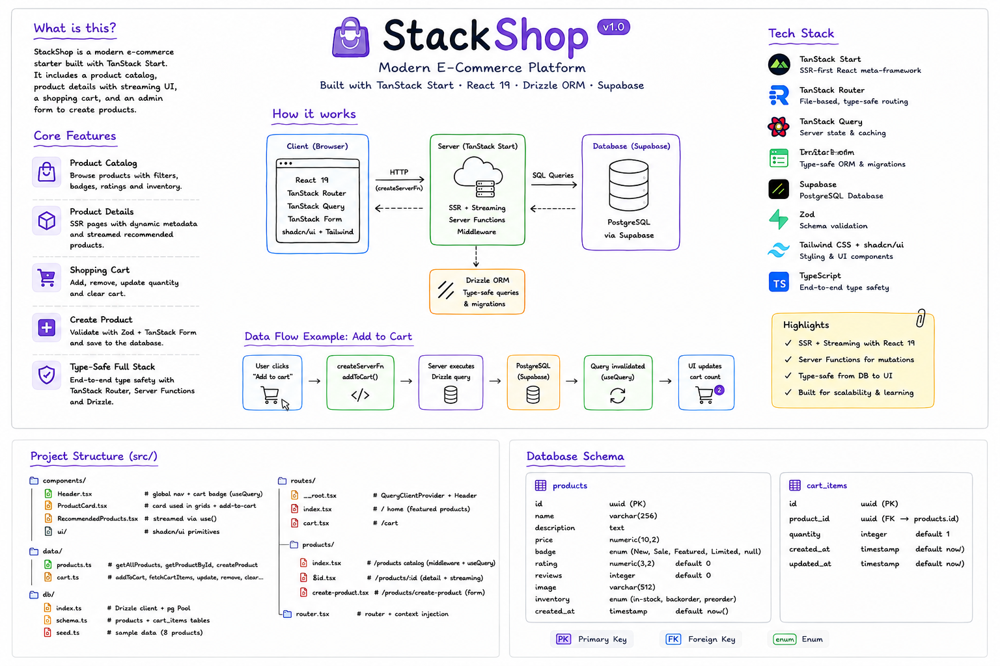
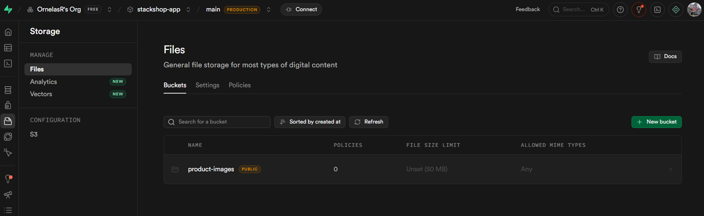

# StackShop — Modern E-Commerce Platform 🛒

> Built with TanStack Start · React 19 · Drizzle ORM · Supabase

---

## Table of Contents

**Overview**
- [🤔 What is this?](#overview)
- [🛠️ Core Technologies](#core-technologies)
- [💫 Application Features](#application-features)
- [📁 Project Structure](#project-structure)
- [🗄️ Database Schema](#database-schema)

**Build Log**
- [🏗️ Phase 1 — Project Foundation](#phase-1)
  - [Step 1 — Scaffold the project](#p1-s1)
  - [Step 2 — Cleanup, Header & product routes](#p1-s2)
  - [Step 3 — Add shadcn/ui on top of Tailwind](#p1-s3)
  - [Step 4 — Base Header design](#p1-s4)
- [📦 Phase 2 — Data Layer & Product Display](#phase-2)
  - [Step 1 — Fake product data & server loader](#p2-s1)
  - [Step 2 — ProductCard component](#p2-s2)
  - [Step 3 — Products catalog page](#p2-s3)
  - [Step 4 — Route Middleware](#p2-s4)
  - [Step 5 — TanStack Query integration](#p2-s5)
- [🐘 Phase 3 — Database Setup with Drizzle + Supabase](#phase-3)
  - [Step 1 — Install dependencies](#p3-s1)
  - [Step 2 — Create a Supabase project](#p3-s2)
  - [Step 3 — Configure .env](#p3-s3)
  - [Step 4 — Database client](#p3-s4)
  - [Step 5 — Define the schema](#p3-s5)
  - [Step 6 — Drizzle config](#p3-s6)
  - [Step 7 — Add scripts to package.json](#p3-s7)
  - [Step 8 — Generate and push the schema](#p3-s8)
  - [Step 9 — Seed the database](#p3-s9)
- [🔌 Phase 4 — Real Data Layer](#phase-4)
  - [Step 1 — Install Zod](#p4-s1)
  - [Step 2 — Create src/data/products.ts](#p4-s2)
  - [Step 3 — Wire routes to the data layer](#p4-s3)
  - [Step 4 — Product detail page](#p4-s4)
  - [Step 5 — Dynamic metadata](#p4-s5)
- [⚡ Phase 5 — Streaming UI & Loading States](#phase-5)
  - [Step 1 — Suspense + use() for streamed recommended products](#p5-s1)
- [📝 Phase 6 — Create Product Form](#phase-6)
  - [Step 1 — Install TanStack Form](#p6-s1)
  - [Step 2 — Install shadcn/ui form components](#p6-s2)
  - [Step 3 — productSchema & createProduct](#p6-s3)
  - [Step 4 — create-product.tsx route](#p6-s4)
- [🛒 Phase 7 — Cart Page](#phase-7)
  - [Step 1 — Add the empty component](#p7-s1)
  - [Step 2 — Cart page layout](#p7-s2)
  - [Step 3 — addToCart](#p7-s3)
  - [Step 4 — fetchCartItems](#p7-s4)
  - [Step 5 — removeFromCart](#p7-s5)
  - [Step 6 — updateCartQuantity](#p7-s6)
  - [Step 7 — clearCart](#p7-s7)
  - [Step 8 — Cart badge in the Header](#p7-s8)
- [🔐 Phase 8 — Authentication with Better Auth](#phase-8)
  - **Installation**
    - [Step 1 — Auth UI pages (shadcn/ui)](#p8-s1)
    - [Step 2 — Install better-auth](#p8-s2)
    - [Step 3 — Environment variables](#p8-s3)
    - [Step 4 — Create the auth instance](#p8-s4)
    - [Step 5 — Generate & merge auth schema](#p8-s5)
    - [Step 6 — Mount the API handler](#p8-s6)
    - [Step 7 — Create the client instance](#p8-s7)
  - **Register**
    - [Step 8 — Register User](#p8-s8)
  - **Login**
    - [Step 9 — Login User](#p8-s9)
  - **Sign Out**
    - [Step 10 — Sign Out](#p8-s10)
  - **Cache & Session Sync**
    - [Step 1 — Session in root context & `router.invalidate()`](#p9-s5)
  - **Protecting Resources**
    - [Step 1 — Auth server functions](#p9-s1)
    - [Step 2 — Protect routes with `beforeLoad`](#p9-s2)
    - [Step 3 — Hide nav links by role](#p9-s3)
    - [Step 4 — Protect the server function](#p9-s6)
    - [Step 5 — Adaptive Header & user dropdown](#p9-s4)
- [🔔 Phase 9 — Toast Notifications with Sonner](#phase-9)
  - [Step 1 — Install Sonner](#p10-s1)
  - [Step 2 — Mount the Toaster](#p10-s2)
  - [Step 3 — Trigger toasts from components](#p10-s3)
- [🖼️ Phase 10 — Image Upload with Supabase Storage](#phase-10)
  - [Step 1 — Create the Bucket](#p10-storage-s1)
  - [Step 2 — Configure RLS Policies](#p10-storage-s2)
  - [Step 3 — Environment variables](#p10-storage-s3)
  - [Step 4 — Install dependencies](#p10-storage-s4)
  - [Step 5 — Create the Supabase client](#p10-storage-s5)
  - [Step 6 — Server Function for image upload](#p10-storage-s6)
  - [Step 7 — Modify create-product.tsx](#p10-storage-s7)

---

<a id="overview"></a>

## What is this?

**StackShop** is a base project designed to serve as the foundation for any future e-commerce.

---

<a id="core-technologies"></a>

## 🛠️ Core Technologies

| Layer | Technology |
| --- | --- |
| **Framework** | [TanStack Start](https://tanstack.com/start) — SSR-first React meta-framework powered by Nitro |
| **Routing** | [TanStack Router](https://tanstack.com/router) — File-based, fully type-safe routing |
| **Server State** | [TanStack Query](https://tanstack.com/query) — Client-side caching, background refetch |
| **Forms** | [TanStack Form](https://tanstack.com/form) — Headless, field-level reactive forms |
| **Database** | [PostgreSQL](https://www.postgresql.org/) via [Supabase](https://supabase.com/) |
| **ORM** | [Drizzle ORM](https://orm.drizzle.team/) — Type-safe query builder + migrations |
| **Styling** | [Tailwind CSS v4](https://tailwindcss.com/) + [shadcn/ui](https://ui.shadcn.com/) |
| **Validation** | [Zod](https://zod.dev/) — Runtime schema validation |
| **Language** | [TypeScript](https://www.typescriptlang.org/) 5.7 |
| **Toolchain** | [Vite](https://vitejs.dev/) 8 + [Biome](https://biomejs.dev/) (lint & format) |

---

<a id="application-features"></a>

## 💫 Application Features

- **Product catalog** — browsable grid with badges, ratings, reviews, and inventory status
- **Product detail page** — SSR with dynamic metadata (`<head>`) per product
- **Streaming UI** — recommended products load via React 19 `use()` + `<Suspense>` with skeleton fallback
- **Create product form** — field-level Zod validation via TanStack Form, writes to the real DB
- **Shopping cart** — add, remove, update quantity, clear cart; all persisted in PostgreSQL
- **Cart badge in header** — live item count and total via `useQuery`, invalidated on every mutation
- **Server Functions** — `createServerFn` for all data mutations (type-safe HTTP endpoints)
- **Middleware** — server-side request logging via `createMiddleware` on the `/products` route
- **Query caching** — `useQuery` with `initialData` from the loader; no duplicate network requests
- **Selective SSR** — each route controls its own rendering strategy independently

---

<a id="project-structure"></a>

## 📁 Project Structure

```
src/
├── components/
│   ├── Header.tsx                  ← global nav + cart badge (useQuery)
│   ├── ProductCard.tsx             ← card used in grids + add-to-cart button
│   ├── RecommndedProducts.tsx      ← unwraps streamed Promise via use()
│   └── ui/                         ← shadcn/ui primitives (button, card, input…)
├── data/
│   ├── products.ts                 ← getAllProducts · getProductById · createProduct
│   └── cart.ts                     ← addToCart · fetchCartItems · removeFromCart · updateCartQuantity · clearCart · getCartItemsCount
├── lib/
│   ├── auth.ts                     ← Better Auth server instance (drizzle adapter + tanstackStartCookies)
│   ├── auth-client.ts              ← Browser auth client (signIn · signUp · useSession)
│   └── auth.functions.ts           ← getSession · ensureSession · sessionQueryKey
├── db/
│   ├── index.ts                    ← Drizzle client + pg Pool
│   ├── schema.ts                   ← products + cart_items tables, enums, inferred types
│   └── seed.ts                     ← sample data (8 products)
├── routes/
│   ├── __root.tsx                  ← QueryClientProvider + Header + global shell
│   ├── index.tsx                   ← / home (featured products, SSR loader)
│   ├── cart.tsx                    ← /cart page
│   └── products/
│       ├── index.tsx               ← /products catalog (middleware + useQuery)
│       ├── $id.tsx                 ← /products/:id detail + streaming recommended
│       └── create-product.tsx      ← /products/create-product form
└── router.tsx                      ← router + QueryClient context injection
```

---

<a id="database-schema"></a>

## 🗄️ Database Schema

### `products`

| Column | Type | Notes |
| --- | --- | --- |
| `id` | `uuid` | Primary key, auto-generated |
| `name` | `varchar(256)` | Product name |
| `description` | `text` | Full description |
| `price` | `numeric(10,2)` | Stored as numeric, arrives as `string` |
| `badge` | `enum` | `New` · `Sale` · `Featured` · `Limited` · `null` |
| `rating` | `numeric(3,2)` | Default `0` |
| `reviews` | `integer` | Default `0` |
| `image` | `varchar(512)` | URL to product image |
| `inventory` | `enum` | `in-stock` · `backorder` · `preorder` |
| `created_at` | `timestamp` | Auto-set on insert |

### `cart_items`

| Column | Type | Notes |
| --- | --- | --- |
| `id` | `uuid` | Primary key, auto-generated |
| `product_id` | `uuid` | FK → `products.id` (cascade delete) |
| `quantity` | `integer` | Default `1` |
| `created_at` | `timestamp` | Auto-set on insert |
| `updated_at` | `timestamp` | Updated on quantity change |

> Types are derived via Drizzle's `$inferSelect` / `$inferInsert` — no manual interfaces needed.

---

---

<a id="build-log"></a>

## Build Log — Step by Step

This is a living document. Each step gets checked off as it's done.

<a id="phase-1"></a>

### Phase 1 — Project Foundation

- [x] <a id="p1-s1"></a>**Step 1 — Scaffold the project** with the TanStack CLI

  ```bash
  npx @tanstack/cli@latest create
  ```

  Selected options:
  - Framework → **React**
  - Toolchain → **Biome**
  - Deployment adapter → **Railway**
  - Add-ons → **Compiler**

- [x] <a id="p1-s2"></a>**Step 2 — Cleanup, Header & product routes** 🧹

  Stripped the boilerplate, built the first component, and added the product routes.

  ```
  src/
  ├── components/
  │   └── Header.tsx       ← basic header component
  └── routes/
      ├── products.tsx     ← static route /products
      └── products.$id.tsx ← dynamic route /products/$id
  ```

  What was done:
  - Removed unused boilerplate code and placeholder files
  - Created a basic `Header` component
  - Added static route `/products`
  - Added dynamic route `/products/$id`

- [x] <a id="p1-s3"></a>**Step 3 — Add shadcn/ui on top of Tailwind** 🎨

  TanStack Start ships with Tailwind by default — we keep it and layer shadcn/ui on top for a proper component library foundation.

  Go to https://ui.shadcn.com/create?preset=bcj03CWG&template=start&base=base and configure to your requirements:
  - Template → **TanStack Start**
  - Base UI → **Base**
  - Enable **pointer** on buttons

  Then run the generated init command:

  ```bash
  npx shadcn@latest init --preset bcj03CWG --base base --template start --pointer
  ```

  Add the `card` component:

  ```bash
  npx shadcn@latest add card
  ```

  Finally, remove the auto-generated import from `src/styles.css` — it's no longer needed:

  ```css
  /* remove this line */
  @import "shadcn/tailwind.css";
  ```

- [x] <a id="p1-s4"></a>**Step 4 — Base Header design** 🏠

  Styled the `Header` component and added the global layout wrapper in `__root.tsx`.

  In `src/routes/__root.tsx`, the `RootDocument` shell wraps the entire app with a background and constrains the content:

  What was done:
  - Outer `div` sets full-height background and base text colors (light + dark mode)
  - `<main>` centers content with `mx-auto`, caps width at `max-w-6xl`, and adds horizontal (`px-4`) and vertical (`py-6`) padding

---

<a id="phase-2"></a>

### Phase 2 — Data Layer & Product Display

- [x] <a id="p2-s1"></a>**Step 1 — Fake product data & server loader** 🗄️

  Wired up the home page with real data flow using TanStack Router's `loader` — the closest thing to a server function in this stack.

  Created a local seed file to act as the fake data source (same shape as a real product API like `fakestoreapi.com`):

  ```
  src/
  └── db/
      └── seed.ts    ← sampleProducts array — fake catalog data
  ```

  The `loader` in `src/routes/index.tsx` runs on the server, grabs the first 3 products, and passes them to the component via `Route.useLoaderData()`:

  ```ts
  export const Route = createFileRoute("/")({
    loader: async () => {
      return { products: sampleProducts.slice(0, 3) };
    },
    component: App,
  });
  ```

  Each product has this shape:

  | Field         | Type      | Description                                         |
  | ------------- | --------- | --------------------------------------------------- |
  | `name`        | `string`  | Product name                                        |
  | `description` | `string`  | Short description                                   |
  | `price`       | `string`  | Price as a string (e.g. `"99.99"`)                  |
  | `badge`       | `string?` | Optional label shown as a pill (e.g. `"New"`)       |
  | `rating`      | `string`  | Star rating (e.g. `"4.8"`)                          |
  | `reviews`     | `number`  | Total review count                                  |
  | `image`       | `string`  | Path to the product image                           |
  | `inventory`   | `string`  | Status: `"in-stock"` · `"backorder"` · `"preorder"` |

  What was done:
  - Created `src/db/seed.ts` with 8 sample products
  - Added a `loader` to the index route — runs server-side before render
  - Consumed loader data in the component via `Route.useLoaderData()`
  - Sliced the first 3 products for the featured section on the home page

- [x] <a id="p2-s2"></a>**Step 2 — ProductCard component** 🃏

  Built the base `ProductCard` component used to display individual products in the grid.

  ```
  src/
  └── components/
      └── ui/
          └── ProductCard.tsx    ← base product card component
  ```

  The card is wrapped in a `<Link>` to navigate to `/products/$id` and composes shadcn/ui primitives (`Card`, `CardHeader`, `CardContent`, `CardFooter`).

  Key design decisions:
  - Optional `badge` pill rendered conditionally (e.g. "New")
  - Rating + review count in the content area
  - Inventory status badge with color-coded styles:
    - `in-stock` → emerald
    - `backorder` → amber
    - `preorder` → indigo
  - "Add to Cart" button uses `e.preventDefault()` + `e.stopPropagation()` to prevent navigation while inside the `<Link>` wrapper

- [x] <a id="p2-s3"></a>**Step 3 — Products catalog page** 🗂️

  Built the full `/products` catalog page that fetches and displays all products using a **server function** — a step up from the plain `loader` used on the home page.

  ```
  src/
  └── routes/
      └── products/
          └── index.tsx    ← /products catalog route
  ```

  Key differences from the home page `loader`:

  | Feature        | Home (`/`)      | Catalog (`/products`)   |
  | -------------- | --------------- | ----------------------- |
  | Data source    | inline `loader` | `createServerFn`        |
  | Products shown | 3 (sliced)      | All 8                   |
  | Layout         | featured grid   | header card + full grid |

  The `createServerFn` pattern isolates the data-fetching logic and makes it independently callable — it's not tied to the route lifecycle like a `loader`:

  ```ts
  const fetchProducts = createServerFn({ method: "GET" }).handler(async () => {
    return sampleProducts;
  });

  export const Route = createFileRoute("/products/")({
    loader: async () => fetchProducts(),
    component: RouteComponent,
  });
  ```

- [x] <a id="p2-s4"></a>**Step 4 — Route Middleware** 🔍

  Added server-side middleware to the `/products` route using `createMiddleware` from `@tanstack/react-start`.

  **What is middleware here?**

  In TanStack Start, middleware runs on the server **before** the route handler executes. It intercepts the request, can inspect or modify it, and must call `next()` to pass control forward — same mental model as Express or Hono middleware.

  ```ts
  // src/routes/products/index.tsx

  const loggerMiddleware = createMiddleware().server(
    async ({ next, request }) => {
      console.log(
        "-----loggerMiddleware----",
        request.url, // full URL of the incoming request
        "from",
        request.headers.get("origin"), // where the request came from
      );
      return next(); // REQUIRED — without this the route never loads
    },
  );
  ```

  **How it's wired to the route:**

  The `server` config key on `createFileRoute` accepts a `middleware` array. Every entry runs in order before any loader or handler on that route:

  ```ts
  export const Route = createFileRoute("/products/")({
    loader: async () => fetchProducts(),
    component: RouteComponent,
    server: {
      middleware: [loggerMiddleware], // ← runs first, on every request to /products
      handlers: {
        POST: async ({ request }) => {
          // ← custom HTTP verb handlers
          const body = await request.json().catch(() => ({}));
          return Response.json({ message: "Hello from POST", body });
        },
      },
    },
  });
  ```

  | Key          | What it does                                                               |
  | ------------ | -------------------------------------------------------------------------- |
  | `middleware` | Array of middleware that intercept every request to this route             |
  | `handlers`   | Custom HTTP method handlers (`POST`, `PUT`, etc.) beyond the default `GET` |
  | `next()`     | Passes control to the next middleware or to the route itself — mandatory   |

- [x] <a id="p2-s5"></a>**Step 5 — TanStack Query integration** ⚡

  Added `@tanstack/react-query` to enable client-side caching and background refetching on top of the existing server-fetched data.

  ```bash
  npm i @tanstack/react-query @tanstack/react-query-devtools
  ```

  **Why Query on top of loaders?**

  The `loader` already fetches on the server — but once the page is live, it does nothing. TanStack Query takes over on the client: it caches the data, can refetch in the background, and invalidates stale entries automatically. The `loader` becomes the "first paint" supplier; Query owns the lifecycle after that.

  ***

  **Change 1 — `createRootRouteWithContext`** in `src/routes/__root.tsx`

  Replaced `createRootRoute` with the typed context variant so every child route can access the `queryClient` with full type safety:

  ```ts
  // before
  export const Route = createRootRoute({ ... });

  // after
  export const Route = createRootRouteWithContext<{ queryClient: QueryClient }>()({ ... });
  ```

  ***

  **Change 2 — `QueryClientProvider` wraps the app shell** in `src/routes/__root.tsx`

  Created a singleton `queryClient` and wrapped `RootDocument` so every component in the tree can call `useQuery`:

  ```ts
  const queryClient = new QueryClient();

  function RootDocument({ children }: { children: React.ReactNode }) {
    return (
      <QueryClientProvider client={queryClient}>
        ...
      </QueryClientProvider>
    );
  }
  ```

  ***

  **Change 3 — inject `queryClient` into the router context** in `src/router.tsx`

  Passed the client through the router's `context` option — this is what makes `context.queryClient` available inside any `loader`:

  ```ts
  const router = createTanStackRouter({
    routeTree,
    context: {
      queryClient: new QueryClient(),
    },
    ...
  });
  ```

  ***

  **Change 4 — `useQuery` with `initialData` in `/products`**

  The `loader` still runs on the server and returns the products. `useQuery` receives them via `initialData` — no duplicate network request on mount. After that, Query owns the cache:

  ```ts
  function RouteComponent() {
    const products = Route.useLoaderData(); // server data

    const { data } = useQuery({
      queryKey: ["products"],
      queryFn: () => fetchProducts(),
      initialData: products, // seed from loader, no extra fetch
    });
  }
  ```

  | Layer      | Runs on | Responsibility                              |
  | ---------- | ------- | ------------------------------------------- |
  | `loader`   | Server  | First fetch — data ready before first paint |
  | `useQuery` | Client  | Cache, background refetch, stale management |

  ***

  **Change 5 — React Query Devtools** in `src/routes/__root.tsx`

  Added the devtools panel so you can inspect the query cache, stale times, and refetch behavior directly in the browser:

  ```ts
  import { ReactQueryDevtools } from "@tanstack/react-query-devtools";

  function RootDocument({ children }) {
    return (
      <QueryClientProvider client={queryClient}>
        ...
        <ReactQueryDevtools initialIsOpen={false} />
      </QueryClientProvider>
    );
  }
  ```

  `initialIsOpen={false}` keeps it collapsed by default — click the React Query logo in the corner to open it.

  ***

  **Selective Server-Side Rendering (SSR)**

  TanStack Start lets you control how much of the rendering happens on the server, per route:

  | Mode          | HTML on server | Data on server | Use when                                      |
  | ------------- | -------------- | -------------- | --------------------------------------------- |
  | `ssr: true`   | ✅ Full HTML   | ✅ Yes         | SEO-critical pages, fast first paint needed   |
  | `"data-only"` | ❌ Empty shell | ✅ Yes         | Data ready but HTML rendered on client        |
  | `ssr: false`  | ❌ Nothing     | ❌ No          | Fully client-side, behind auth, no SEO needed |

  "Selective" means you don't pick one mode for the whole app — each route decides independently. A public `/products` page can run full SSR while a `/dashboard` behind a login runs `ssr: false`.

---

<a id="phase-3"></a>

### Phase 3 — Database Setup with Drizzle + Supabase

- [x] <a id="p3-s1"></a>**Step 1 — Install dependencies** 📦

  ```bash
  npm i drizzle-orm postgres pg
  npm i -D drizzle-kit
  npm i --save-dev @types/pg
  npm i drizzle-orm dotenv
  npm i -D drizzle-kit tsx
  ```

  | Package       | Role                                             |
  | ------------- | ------------------------------------------------ |
  | `drizzle-orm` | The ORM — type-safe query builder                |
  | `postgres`    | Native PostgreSQL driver (used by Drizzle)       |
  | `pg`          | Node.js PostgreSQL driver (for the Pool client)  |
  | `dotenv`      | Load `.env` vars before running scripts          |
  | `drizzle-kit` | CLI for migrations, codegen, and Drizzle Studio  |
  | `tsx`         | Run TypeScript files directly (used for seeding) |
  | `@types/pg`   | Type definitions for the `pg` driver             |
  | `cross-env`   | Set env variables cross-platform (Win/Mac/Linux) |

- [x] <a id="p3-s2"></a>**Step 2 — Create a Supabase project** ☁️
  1. Go to [supabase.com](https://supabase.com) and create a new project
  2. Once created, navigate to **Project Settings → Database**
  3. Under **Connection string**, select **Session pooler** mode and copy the URI:

  ```
  postgresql://postgres.<project-ref>:[YOUR-PASSWORD]@aws-1-us-west-2.pooler.supabase.com:5432/postgres
  ```

  Session pooler works over port `5432` — no firewall issues and compatible with Drizzle's `pg` driver.

- [x] <a id="p3-s3"></a>**Step 3 — Configure `.env`** 🔐

  Create a `.env` file at the project root and paste the connection string, replacing `[YOUR-PASSWORD]`:

  ```env
  DATABASE_URL="postgresql://postgres.fceondpyuqyitudbtnuw:<yourpassword>@aws-1-us-west-2.pooler.supabase.com:5432/postgres"
  ```

- [x] <a id="p3-s4"></a>**Step 4 — Database client** `src/db/index.ts`

  The client creates a connection pool and exports a typed `db` instance wired to the schema:

  ```ts
  import { drizzle } from "drizzle-orm/node-postgres";
  import { Pool } from "pg";
  import * as schema from "./schema";

  if (!process.env.DATABASE_URL) {
    throw new Error("DATABASE_URL is not set");
  }

  const pool = new Pool({
    connectionString: process.env.DATABASE_URL,
    ssl: process.env.DATABASE_URL?.includes("supabase")
      ? { rejectUnauthorized: false }
      : false,
  });

  export const db = drizzle(pool, { schema });
  ```

  The `ssl` block is conditional — it enables SSL only when connecting to Supabase, so local development without SSL still works.

- [x] <a id="p3-s5"></a>**Step 5 — Define the schema** `src/db/schema.ts`

  Two tables: `products` (the catalog) and `cart_items` (shopping cart). Both use UUID primary keys and Drizzle enums for constrained string fields.

  ```ts
  import {
    integer,
    numeric,
    pgEnum,
    pgTable,
    text,
    timestamp,
    uuid,
    varchar,
  } from "drizzle-orm/pg-core";

  export const badgeEnum = pgEnum("badge", [
    "New",
    "Sale",
    "Featured",
    "Limited",
  ]);
  export const inventoryEnum = pgEnum("inventory", [
    "in-stock",
    "backorder",
    "preorder",
  ]);

  export const products = pgTable("products", {
    id: uuid("id").primaryKey().defaultRandom(),
    name: varchar("name", { length: 256 }).notNull(),
    description: text("description").notNull(),
    price: numeric("price", { precision: 10, scale: 2 }).notNull(),
    badge: badgeEnum("badge"),
    rating: numeric("rating", { precision: 3, scale: 2 })
      .notNull()
      .default("0"),
    reviews: integer("reviews").notNull().default(0),
    image: varchar("image", { length: 512 }).notNull(),
    inventory: inventoryEnum("inventory").notNull().default("in-stock"),
    createdAt: timestamp("created_at").defaultNow().notNull(),
  });

  export const cartItems = pgTable("cart_items", {
    id: uuid("id").primaryKey().defaultRandom(),
    productId: uuid("product_id")
      .notNull()
      .references(() => products.id, { onDelete: "cascade" }),
    quantity: integer("quantity").notNull().default(1),
    createdAt: timestamp("created_at").defaultNow().notNull(),
    updatedAt: timestamp("updated_at").defaultNow().notNull(),
  });

  // Inferred types — use these everywhere instead of manual interfaces
  export type ProductSelect = typeof products.$inferSelect;
  export type ProductInsert = typeof products.$inferInsert;
  export type CartItemSelect = typeof cartItems.$inferSelect &
    typeof products.$inferSelect;
  export type CartItemInsert = typeof cartItems.$inferInsert;
  ```

  `$inferSelect` and `$inferInsert` let Drizzle derive the TypeScript types directly from the schema — no duplication.

- [x] <a id="p3-s6"></a>**Step 6 — Drizzle config** `drizzle.config.ts`

  ```ts
  import "dotenv/config";
  import { defineConfig } from "drizzle-kit";

  export default defineConfig({
    out: "./drizzle",
    schema: "./src/db/schema.ts",
    dialect: "postgresql",
    dbCredentials: {
      url: process.env.DATABASE_URL!,
    },
  });
  ```

  | Field     | Purpose                                           |
  | --------- | ------------------------------------------------- |
  | `out`     | Where Drizzle writes migration SQL files          |
  | `schema`  | Source of truth — your schema definition          |
  | `dialect` | Database engine (`postgresql`, `mysql`, `sqlite`) |

- [x] <a id="p3-s7"></a>**Step 7 — Add scripts to `package.json`** ⚙️

  ```json
  "scripts": {
    "db:generate": "drizzle-kit generate",
    "db:migrate":  "drizzle-kit migrate",
    "db:push":     "drizzle-kit push",
    "db:studio":   "drizzle-kit studio",
    "db:seed":     "cross-env NODE_ENV=production NITRO_PRESET=node-server tsx src/db/seedDb.ts"
  }
  ```

  | Script        | What it does                                              |
  | ------------- | --------------------------------------------------------- |
  | `db:generate` | Reads the schema and generates SQL migration files        |
  | `db:migrate`  | Applies pending migration files to the database           |
  | `db:push`     | Pushes the schema directly — no migration files generated |
  | `db:studio`   | Opens Drizzle Studio (visual DB browser)                  |
  | `db:seed`     | Populates the database with sample products               |

  > In production use `generate` + `migrate` for a proper migration history. `push` is fast for prototyping — it diffs and applies directly.

- [x] <a id="p3-s8"></a>**Step 8 — Generate and push the schema** 🚀

  Generate the SQL migration files from your schema:

  ```bash
  npm run db:generate
  ```

  This writes files to `./drizzle/`. Then push the schema to Supabase:

  ```bash
  npm run db:push
  ```

  Once done, open your Supabase project → **Table Editor** — the `products` and `cart_items` tables are there.

- [x] <a id="p3-s9"></a>**Step 9 — Seed the database** 🌱

  `src/db/seedDb.ts` inserts 8 sample products. It checks for existing rows before inserting — pass `--reset` to wipe and reseed.

  **Why not just run `tsx src/db/seedDb.ts` directly?**

  TanStack Start uses **Nitro** as its internal server engine. When you import the DB client (`src/db/index.ts`) inside a standalone script, Nitro detects the environment and tries to boot its full server runtime — which fails outside of the framework's normal startup process.

  The fix is to set two environment variables before the script runs:

  | Variable       | Value         | Effect                                                      |
  | -------------- | ------------- | ----------------------------------------------------------- |
  | `NODE_ENV`     | `production`  | Disables dev-mode behavior (HMR, Vite watchers, etc.)       |
  | `NITRO_PRESET` | `node-server` | Tells Nitro to use the plain Node.js adapter — no full boot |

  These are set at the very top of `seedDb.ts` as well, as a safety net:

  ```ts
  // Prevent Nitro/vite from initializing when running as a standalone script
  process.env.NITRO_PRESET = "node-server";
  process.env.NODE_ENV = process.env.NODE_ENV || "production";
  ```

  **`cross-env`** is also needed because the `VAR=value command` syntax for setting env vars only works on Mac/Linux. On Windows it fails silently. `cross-env` makes it work everywhere with the same syntax.

  Run the seed:

  ```bash
  npm run db:seed
  ```

  Output:

  ```
  🌱 Starting database seed...
  📦 Inserting sample products...
  ✅ Products inserted successfully!
  ```

  Run with reset flag to clear and repopulate:

  ```bash
  npm run db:seed -- --reset
  ```

---

<a id="phase-4"></a>

### Phase 4 — Real Data Layer

- [x] <a id="p4-s1"></a>**Step 1 — Install Zod** 📦

  ```bash
  npm install zod
  ```

  Zod is a TypeScript-first schema validation library. It validates data at **runtime** — something TypeScript alone can't do (types disappear after compile). We use it here to validate the `id` received by `getProductById` before it reaches the database.

- [x] <a id="p4-s2"></a>**Step 2 — Create `src/data/products.ts`** 🗄️

  Instead of writing `createServerFn` directly inside each route file, all server functions live in a dedicated data layer:

  ```
  src/
  └── data/
      └── products.ts    ← all server functions for the products domain
  ```

  This file exports three functions:

  ```ts
  import { createServerFn } from "@tanstack/react-start";
  import { eq } from "drizzle-orm";
  import { z } from "zod";
  import { db } from "@/db";
  import { products } from "@/db/schema";

  // Fetches every product — used in /products
  export const getAllProducts = createServerFn({ method: "GET" }).handler(
    async () => {
      const allProducts = await db.select().from(products);
      return allProducts;
    },
  );

  // Fetches the first 3 — used on the home page
  export const getRecommendedProducts = createServerFn({
    method: "GET",
  }).handler(async () => {
    const recommendedProducts = await db.select().from(products).limit(3);
    return recommendedProducts;
  });

  // Fetches a single product by id — used in /products/$id
  const idSchema = z.string();

  export const getProductById = createServerFn({ method: "GET" })
    .inputValidator((id: string) => id)
    .handler(async ({ data }) => {
      const id = idSchema.parse(data); // runtime validation with Zod
      const product = await db
        .select()
        .from(products)
        .where(eq(products.id, id))
        .limit(1);
      return product[0] ?? null;
    });
  ```

  **Why server functions live in `data/` and not inside the route files**

  `createServerFn` creates an HTTP endpoint that runs exclusively on the server. The function can be called from anywhere — a loader, a form action, another server function. If you write it inline in a route file, it's trapped there. Moving it to `data/products.ts` means:
  - `getRecommendedProducts` can be called from the home loader
  - `getAllProducts` can be called from the products loader AND from a `useQuery` on the client
  - `getProductById` can be called from the detail page loader

  Routes handle routing and rendering. The data layer handles data access. That separation is what makes the code reusable and easy to test.

  | Function                 | Called from                     | Returns                  |
  | ------------------------ | ------------------------------- | ------------------------ |
  | `getAllProducts`         | `/products` loader + `useQuery` | All products             |
  | `getRecommendedProducts` | `/` loader                      | First 3 products         |
  | `getProductById`         | `/products/$id` loader          | Single product or `null` |

- [x] <a id="p4-s3"></a>**Step 3 — Wire routes to the data layer** 🔌

  Each route now just imports and calls the right function. No data logic in the route:

  **`src/routes/index.tsx`** — home page:

  ```ts
  import { getRecommendedProducts } from "@/data/products";

  export const Route = createFileRoute("/")({
    loader: async () => getRecommendedProducts(),
    component: App,
  });
  ```

  **`src/routes/products/index.tsx`** — catalog:

  ```ts
  import { getAllProducts } from "#/data/products";

  export const Route = createFileRoute("/products/")({
    loader: async () => getAllProducts(),
    component: RouteComponent,
  });

  function RouteComponent() {
    const products = Route.useLoaderData();
    const { data } = useQuery({
      queryKey: ["products"],
      queryFn: () => getAllProducts(), // client-side cache
      initialData: products,
    });
  }
  ```

  **`src/routes/products/$id.tsx`** — product detail:

  ```ts
  import { getProductById } from "#/data/products";

  export const Route = createFileRoute("/products/$id")({
    loader: async ({ params }) => getProductById({ data: params.id }),
    component: RouteComponent,
  });
  ```

  The `params.id` from the URL is passed as `data` — which is the input that `.inputValidator()` receives, and Zod validates before the handler runs.

- [x] <a id="p4-s4"></a>**Step 4 — Product detail page** 🖼️

  Built the `/products/$id` route — the full product detail view consuming real data from the database.

  ```
  src/
  └── routes/
      └── products/
          └── $id.tsx    ← dynamic detail route
  ```

  The loader fetches the product by URL param and passes it to the component:

  ```ts
  export const Route = createFileRoute("/products/$id")({
    loader: async ({ params }) => getProductById({ data: params.id }),
    component: RouteComponent,
  });
  ```

  The component reads the loader result with `useLoaderData()` — no hooks, no client fetch, just typed data:

  ```ts
  function RouteComponent() {
    const product = Route.useLoaderData();
    // product is fully typed as ProductSelect | null (inferred from schema)
  }
  ```

  **How data flows from the DB to the template**

  The type comes from Drizzle's `$inferSelect` defined in `src/db/schema.ts`. You never write a manual interface — the schema IS the type:

  ```ts
  // src/db/schema.ts
  export type ProductSelect = typeof products.$inferSelect;
  // { id: string, name: string, price: string, badge: "New" | "Sale" | ... | null, ... }
  ```

  From there, mapping to the template is direct property access:

  | DB column           | Template usage                           | Notes                                       |
  | ------------------- | ---------------------------------------- | ------------------------------------------- |
  | `product.name`      | `<h1>{product?.name}</h1>`               | Optional chaining until null-check          |
  | `product.price`     | `<span>${product?.price}</span>`         | Stored as `numeric` → arrives as `string`   |
  | `product.badge`     | `{product?.badge && <span>{...}</span>}` | `null` collapses the badge pill             |
  | `product.inventory` | Ternary to resolve shipping text         | Enum: `in-stock` · `backorder` · `preorder` |
  | `product.image`     | ``           | URL string stored in DB                     |

  The `?.` optional chaining is needed because `getProductById` returns `Product | null` — if no row matches the `id`, `null` propagates safely instead of crashing.

- [x] <a id="p4-s5"></a>**Step 5 — Dynamic metadata on the product detail page** 🏷️

  Added the `head()` function to the `/products/$id` route so each product page gets its own SEO metadata — title, description, image, and canonical URL — all derived from the loader data.

  ```ts
  export const Route = createFileRoute("/products/$id")({
    loader: async ({ params }) => getProductById({ data: params.id }),
    head: ({ loaderData: product }) => {
      if (!product) return {};
      return {
        meta: [
          { title: product.name },
          { name: "description", content: product.description },
          { name: "image",       content: product.image },
          { name: "canonical",   content: `https://stackshop-prod.appwrite.network/products/${product.id}` },
        ],
      };
    },
  });
  ```

  `head()` runs on the server alongside the loader — `loaderData` is already resolved by the time it executes, so no extra fetch is needed. The canonical URL switches between production and `localhost` based on `NODE_ENV`.

---

<a id="phase-5"></a>

### Phase 5 — Streaming UI & Loading States

- [x] <a id="p5-s1"></a>**Step 1 — Suspense + `use` for streamed recommended products** ⚡

  Added skeleton loading states to the product detail page using React 19's `use` hook, `<Suspense>`, and the shadcn/ui `Skeleton` component.

  Add the skeleton component:

  ```bash
  npx shadcn@latest add skeleton
  ```

  This generates `src/components/ui/skeleton.tsx` — a simple animated pulse div that composes via `className`:

  ```ts
  function Skeleton({ className, ...props }: React.ComponentProps<"div">) {
    return (
      <div
        data-slot="skeleton"
        className={cn("animate-pulse rounded-md bg-muted", className)}
        {...props}
      />
    );
  }
  ```

  ***

  **The key pattern — return a Promise, don't await it**

  In the `/products/$id` loader, the product detail is `await`ed (it must be ready before the page renders), but the recommended products are returned as an **unresolved Promise**:

  ```ts
  loader: async ({ params }) => {
    // awaited — page can't render without this
    const product = await getProductById({ data: params.id });
    if (!product) throw notFound();

    // NOT awaited — returned as a live Promise
    const recommendedProducts = getRecommendedProducts();

    return { product, recommendedProducts };
  },
  ```

  The component receives `recommendedProducts` as a `Promise<ProductSelect[]>`. The product detail section renders immediately with real data. The recommendations section renders a skeleton until the promise resolves.

  ***

  **`use()` unwraps the Promise inside the component**

  React 19's `use` hook reads a Promise and suspends the component until it resolves. It can only be called inside a component wrapped in `<Suspense>`:

  ```ts
  // src/components/RecommndedProducts.tsx

  import { use } from "react";

  export function RecommendedProducts({
    recommendedProducts,
  }: {
    recommendedProducts: Promise<ProductSelect[]>;
  }) {
    const recommendedProductsData = use(recommendedProducts);
    // ...render the grid
  }
  ```

  `use` is NOT a regular hook — it can be called conditionally and inside loops. Its job is specifically to unwrap thenables (Promises) and context values.

  ***

  **`<Suspense>` with a skeleton fallback**

  The `fallback` renders while the Promise is pending. Once `use()` resolves, React swaps in the real component:

  ```tsx
  <Suspense
    fallback={
      <div>
        <h2 className="my-4 text-2xl font-bold">Recommended Products</h2>
        <div className="grid gap-4 sm:grid-cols-2 lg:grid-cols-3">
          {Array.from({ length: 3 }).map((_, index) => (
            <Card key={index}>
              <CardHeader>
                <Skeleton className="aspect-4/3 w-full rounded-xl" />
              </CardHeader>
              <CardContent className="space-y-3">
                <Skeleton className="h-5 w-3/4" />
                <Skeleton className="h-4 w-full" />
                <Skeleton className="h-4 w-2/3" />
                <div className="flex items-center justify-between pt-2">
                  <Skeleton className="h-6 w-20" />
                  <Skeleton className="h-4 w-24" />
                </div>
              </CardContent>
              <CardFooter>
                <Skeleton className="h-10 w-full rounded-md" />
              </CardFooter>
            </Card>
          ))}
        </div>
      </div>
    }
  >
    <RecommendedProducts recommendedProducts={recommendedProducts} />
  </Suspense>
  ```

  | Piece | Role |
  | --- | --- |
  | `getRecommendedProducts()` (no `await`) | Returns a live Promise to the component |
  | `use(promise)` | Suspends the component until the Promise resolves |
  | `<Suspense fallback={...}>` | Renders the skeleton while suspended |
  | `<Skeleton>` | Animated pulse placeholder matching the real card shape |

  The result: the product detail is visible immediately, and the recommended section fades in once the data arrives — no spinner, no layout shift.

---

<a id="phase-6"></a>

### Phase 6 — Create Product Form

- [x] <a id="p6-s1"></a>**Step 1 — Install TanStack Form** 📦

  ```bash
  npm i @tanstack/react-form
  ```

  TanStack Form is a headless, framework-agnostic form library. "Headless" means it manages **state and validation** but ships zero UI — you bring your own components. The key difference from something like React Hook Form: field state lives at the field level, not the form level. Each `<form.Field>` is its own subscriber and only re-renders itself when its value changes — the rest of the form stays untouched.

- [x] <a id="p6-s2"></a>**Step 2 — Install shadcn/ui form components** 🎨

  ```bash
  npx shadcn@latest add label input textarea select
  ```

  | Component  | What it is                                             |
  | ---------- | ------------------------------------------------------ |
  | `Label`    | Accessible `<label>` with proper `htmlFor` wiring      |
  | `Input`    | Styled `<input>` — text, number, url, etc.             |
  | `Textarea` | Styled multi-line `<textarea>`                         |
  | `Select`   | Accessible dropdown built on Radix UI's Select primitive |

- [x] <a id="p6-s3"></a>**Step 3 — Add `productSchema` and `createProduct` to `src/data/products.ts`** 🗄️

  The schema and the server function that writes to the DB both live in the data layer — next to the read functions already there.

  **`productSchema` — the validation contract**

  ```ts
  export const productSchema = z.object({
    name: z.string().min(1, "Name is required"),
    description: z.string().min(1, "Description is required"),
    price: z
      .string()
      .refine((val) => !isNaN(Number(val)), "Price must be a number"),
    badge: z.enum(["New", "Sale", "Featured", "Limited"]).nullable().optional(),
    image: z
      .string()
      .url("Image must be a valid URL")
      .max(512, "Image must be 512 chars or less"),
    inventory: z.enum(["in-stock", "backorder", "preorder"]),
  });
  ```

  Each rule in `productSchema` does two things at once:
  - It **validates** the value at runtime (server-side before hitting the DB, and client-side on each keystroke via TanStack Form's validators)
  - It **describes the error message** shown to the user when validation fails

  Notice `price` is a `string` — the `<input type="number">` always gives you a string. The `.refine()` checks it converts to a real number without coercing the type.

  `badge` is `.nullable().optional()` because it's genuinely optional: a product can have no badge at all.

  **`createProduct` — the server function that writes to the DB**

  ```ts
  export const createProduct = createServerFn({ method: "POST" })
    .inputValidator((data: z.infer<typeof productSchema>) =>
      productSchema.parse(data),
    )
    .handler(async ({ data }): Promise<ProductSelect> => {
      const { db } = await import("@/db");
      const result = await db
        .insert(products)
        .values({ ...data, badge: data.badge ?? null })
        .returning();
      const product = result[0];
      if (!product) {
        throw new Error("Failed to create product: no product returned from database");
      }
      return product;
    });
  ```

  How it works step by step:

  1. `createServerFn({ method: "POST" })` — registers this as an HTTP `POST` endpoint. TanStack Start handles the networking — you call the function like a normal async function, it runs on the server.
  2. `.inputValidator(...)` — before `handler` runs, the input is passed through `productSchema.parse()`. If the data is invalid, it throws and the handler never executes. This is the server-side safety net — validation here protects the DB even if someone bypasses the client form.
  3. `.handler(async ({ data }) => {...})` — `data` is the already-validated, typed payload. Drizzle inserts it and returns the created row via `.returning()`. `badge ?? null` normalizes `undefined` to `null` so Drizzle's nullable column is happy.

  | Chain piece        | What it does                                                          |
  | ------------------ | --------------------------------------------------------------------- |
  | `createServerFn`   | Creates an HTTP endpoint — runs exclusively on the server             |
  | `.inputValidator`  | Validates and parses the raw input before the handler sees it         |
  | `.handler`         | Receives clean, typed `data` — does the actual DB work                |
  | `.returning()`     | Drizzle returns the inserted row — required to get the generated `id` |

- [x] <a id="p6-s4"></a>**Step 4 — Create `src/routes/products/create-product.tsx`** 📝

  The create product route lives at `/products/create-product`. TanStack Router derives this from the file path automatically.

  ```
  src/
  └── routes/
      └── products/
          └── create-product.tsx    ← /products/create-product
  ```

  **How `useForm` is initialized**

  ```ts
  const form = useForm({
    defaultValues: {
      name: "",
      description: "",
      price: "",
      badge: undefined as BadgeValue | undefined,
      image: "",
      inventory: "in-stock" as InventoryValue,
    },
    onSubmit: async ({ value }) => {
      try {
        setSubmitError(null);
        await createProduct({ data: value });
        await router.invalidate({ sync: true }); // bust the /products query cache
        navigate({ to: "/products" });
      } catch {
        setSubmitError("Something went wrong. Please try again.");
      }
    },
  });
  ```

  `useForm` accepts a config object with three key properties used here:

  | Property        | What it does                                                                |
  | --------------- | --------------------------------------------------------------------------- |
  | `defaultValues` | The initial state of every field — must match the shape of the form data    |
  | `onSubmit`      | Runs when the form is submitted and all validators pass — receives `value`  |
  | `validators`    | Form-level validators (field-level validators are set per `<form.Field>`)   |

  After `createProduct` succeeds, `router.invalidate({ sync: true })` tells TanStack Router to re-run all active loaders — the `/products` page data is refreshed before navigating to it, so the new product appears immediately.

  ***

  **The `fieldValidator` helper**

  Each field reuses this small adapter to connect Zod schemas to TanStack Form's validator API:

  ```ts
  function fieldValidator(schema: z.ZodTypeAny) {
    return ({ value }: { value: unknown }) => {
      const result = schema.safeParse(value);
      return result.success ? undefined : result.error.issues[0]?.message;
    };
  }
  ```

  TanStack Form's `onChange` validator expects a function that returns `undefined` (valid) or a `string` (the error message). Zod's `.safeParse()` returns `{ success: true }` or `{ success: false, error }`. This helper bridges the two: it runs Zod's parse and converts the result to what TanStack Form expects. Each field passes in its own slice of `productSchema`:

  ```ts
  validators={{ onChange: fieldValidator(productSchema.shape.name) }}
  ```

  `productSchema.shape.name` is just the `z.string().min(1, ...)` rule for that specific field — you're not running the whole object schema, only the relevant piece.

  ***

  **`<form.Field>` — how each field is wired**

  ```tsx
  <form.Field
    name="name"
    validators={{ onChange: fieldValidator(productSchema.shape.name) }}
  >
    {(field) => (
      <FormField field={field} label="Product Name *">
        <Input
          id={field.name}
          value={field.state.value}
          onChange={(e) => field.handleChange(e.target.value)}
        />
      </FormField>
    )}
  </form.Field>
  ```

  `<form.Field>` uses the **render prop pattern** — it passes a `field` object to its child function. That object contains everything about the field's current state:

  | `field` property          | What it holds                                         |
  | ------------------------- | ----------------------------------------------------- |
  | `field.name`              | The field key (`"name"`, `"price"`, etc.)             |
  | `field.state.value`       | Current value of the field                            |
  | `field.state.meta.errors` | Array of validation error messages                    |
  | `field.state.meta.isTouched` | Whether the user has interacted with the field     |
  | `field.state.meta.isValid` | Whether the field currently passes all validators    |
  | `field.handleChange(val)` | Update the field value and trigger `onChange` validators |

  The `name` prop on `<form.Field>` is **type-safe** — TypeScript infers it from `defaultValues`. If you type `name="namex"` it's a compile error.

  ***

  **`FormField` and `FieldMessage` — reusable layout helpers**

  Two small components handle the repetitive wrapper around each input:

  ```ts
  function FieldMessage({ error }: { error?: string }) {
    if (!error) return null;
    return <p className="text-sm text-destructive">{error}</p>;
  }

  function FormField({ field, label, children }) {
    const error = field.state.meta.isTouched
      ? field.state.meta.errors[0]
      : undefined;

    return (
      <div className="space-y-2">
        <Label htmlFor={field.name}>{label}</Label>
        {children}
        <FieldMessage error={error} />
      </div>
    );
  }
  ```

  The error only shows after `isTouched` is true — this prevents blasting the user with red errors before they've typed anything. Once they leave a field (blur) or type in it, `isTouched` flips to `true` and errors become visible.

  ***

  **`<form.Subscribe>` — reading form-level state**

  The submit button reads two values from the form without subscribing to every field:

  ```tsx
  <form.Subscribe
    selector={(state) => [state.canSubmit, state.isSubmitting]}
  >
    {([canSubmit, isSubmitting]) => (
      <Button type="submit" disabled={!canSubmit || isSubmitting}>
        {isSubmitting ? "Creating..." : "Create Product"}
      </Button>
    )}
  </form.Subscribe>
  ```

  `selector` works like a selector in Redux — it extracts only the values you need. The button re-renders only when `canSubmit` or `isSubmitting` changes. `canSubmit` is `false` when any field has a validation error or when the form is already submitting.

  ***

  **Full data flow — from input to database**

  ```
  User types in <Input>
      ↓
  field.handleChange(value)         ← updates field state
      ↓
  onChange validator runs (Zod)     ← validates on each keystroke
      ↓
  error shown if isTouched + invalid
      ↓
  User clicks "Create Product"
      ↓
  form.handleSubmit()               ← validates all fields
      ↓
  onSubmit({ value }) fires         ← only if all validators pass
      ↓
  createProduct({ data: value })    ← server function (POST to DB)
      ↓
  router.invalidate()               ← busts the /products loader cache
      ↓
  navigate({ to: "/products" })     ← user sees the updated catalog
  ```

---

---

<a id="phase-7"></a>

### Phase 7 — Cart Page

- [x] <a id="p7-s1"></a>**Step 1 — Add the `empty` shadcn/ui component** 📦

  ```bash
  npx shadcn@latest add empty
  ```

  Used in the cart page to render the empty-state UI when there are no items in the cart.

- [x] <a id="p7-s2"></a>**Step 2 — Cart page layout with mock data** 🛒

  Created `src/routes/cart.tsx` with the full layout: item list, quantity controls, order summary, and empty state — all wired to commented-out mock data so the shape is explicit:

  ```ts
  // Mock — same shape as the DB response, useful when copying to another project
  // const cart: CartItem[] = [
  //   { id: "1", name: "TanStack Router Pro", price: "99.99", quantity: 2, image: "...", inventory: "in-stock" },
  // ];
  ```

- [x] <a id="p7-s3"></a>**Step 3 — `addToCart`** ➕

  Created `src/data/cart.ts` with the first server function.

  1. **Server function** — `createServerFn({ method: "POST" })` runs on the server and receives `productId`.
  2. **Upsert logic** — checks if the product already exists in `cartItems`; if it does, increments `quantity`; otherwise inserts a new row.
  3. **Input validation** — `.inputValidator()` types the incoming payload as `{ productId: string }`.
  4. **Button in `ProductCard`** — calls `addToCart({ data: { productId } })` with `e.preventDefault()` + `e.stopPropagation()` to avoid triggering the `<Link>` that wraps the card.
  5. **Router invalidation** — `router.invalidate()` after the call causes TanStack Router to re-run active loaders without a full page reload.

- [x] <a id="p7-s4"></a>**Step 4 — `fetchCartItems`** 📋

  1. **Server function** — does an `innerJoin` between `cartItems` and `products`, then flattens the joined rows into a plain array for the client.

     ```ts
     // The join returns rows shaped as: { cart_items: {...}, products: {...} }
     return rows.map((row) => {
       const cartItem = row.cart_items;
       const product = row.products;
       return { id: cartItem.id, name: product.name, price: product.price, quantity: cartItem.quantity, ... };
     });
     ```

  2. **Loader in `cart.tsx`** — `loader: async () => fetchCartItems()` runs the server function before the page renders.
  3. **`Route.useLoaderData()`** inside `CartPage` — typed data available with no manual fetch.
  4. **Subtotal with `reduce`** — `price` comes as `string` from Drizzle's `numeric` type, so `Number(item.price) * item.quantity` converts it before summing.

- [x] <a id="p7-s5"></a>**Step 5 — `removeFromCart`** 🗑️

  ```ts
  export const removeFromCart = createServerFn({ method: "POST" })
    .inputValidator((data: { cartItemId: string }) => data)
    .handler(async ({ data }) => {
      await db.delete(cartItems).where(eq(cartItems.id, data.cartItemId));
    });
  ```

  In the cart page, a `removingId` state tracks which item is being deleted so only that row's buttons disable — not the whole list. After deletion, `router.invalidate()` refreshes the list.

- [x] <a id="p7-s6"></a>**Step 6 — `updateCartQuantity`** ➕➖

  ```ts
  export const updateCartQuantity = createServerFn({ method: "POST" })
    .inputValidator((data: { cartItemId: string; delta: 1 | -1 }) => data)
    .handler(async ({ data }) => {
      const newQuantity = item.quantity + data.delta;
      if (newQuantity <= 0) {
        await db.delete(cartItems).where(eq(cartItems.id, data.cartItemId));
      } else {
        await db.update(cartItems).set({ quantity: newQuantity, updatedAt: new Date() })...
      }
    });
  ```

  `delta: 1 | -1` keeps the API minimal — the `+` button passes `1`, the `−` button passes `-1`. If the result reaches `0`, the item is deleted automatically.

  In the cart page, an `isBusy` flag (`updatingId === item.id || removingId === item.id`) locks all three buttons of a row while any operation is in flight, preventing double-clicks and race conditions.

- [x] <a id="p7-s7"></a>**Step 7 — `clearCart`** 🧹

  ```ts
  export const clearCart = createServerFn({ method: "POST" }).handler(
    async () => {
      await db.delete(cartItems); // no WHERE — deletes all rows
    },
  );
  ```

  The "Clear cart" button sets a `clearing` boolean, calls `clearCart()`, then calls `router.invalidate()`. The empty state renders automatically once the list comes back empty.

- [x] <a id="p7-s8"></a>**Step 8 — Cart badge in the Header** 🏷️

  The Header needed to show the total item count and cost without loading the full cart data. Four pieces work together to make this happen.

  ***

  **`getCartItemsCount` — a lightweight server function**

  Instead of reusing `fetchCartItems` (which fetches every field of every item), a dedicated function does a single join and returns only two numbers:

  ```ts
  export const getCartItemsCount = createServerFn({ method: "GET" }).handler(
    async () => {
      const rows = await db
        .select()
        .from(cartItems)
        .innerJoin(products, eq(cartItems.productId, products.id));

      const count = rows.reduce((acc, row) => acc + row.cart_items.quantity, 0);
      const total = rows.reduce(
        (acc, row) => acc + Number(row.products.price) * row.cart_items.quantity,
        0,
      );

      return { count, total };
    },
  );
  ```

  `count` is the sum of all quantities (not the number of rows) — if you have 3 units of the same product, it counts as 3, not 1.

  ***

  **`useQuery` in the Header**

  The Header is not a route — it has no loader. `useQuery` is the right tool here: it fetches and caches the data on the client, and refetches automatically on window focus.

  ```ts
  const { data: cartSummary } = useQuery({
    queryKey: cartCountQueryKey,   // ["cart-count"]
    queryFn: () => getCartItemsCount(),
    staleTime: 0,                  // always considered stale → refetch on window focus
  });

  const itemCount = cartSummary?.count ?? 0;
  const total = cartSummary?.total ?? 0;
  ```

  `staleTime: 0` means the cached value is immediately considered stale after it's fetched. This makes React Query refetch automatically the next time the user focuses the window — a useful safety net if the cache ever gets out of sync.

  ***

  **`cartCountQueryKey` — one source of truth for the cache key**

  The query key `["cart-count"]` is used in three different files: `Header.tsx`, `ProductCard.tsx`, and `cart.tsx`. If it were written as a plain string in each file, a typo would silently break the invalidation. Instead, it's exported once from `Header.tsx`:

  ```ts
  // Header.tsx
  export const cartCountQueryKey = ["cart-count"] as const;

  // ProductCard.tsx and cart.tsx
  import { cartCountQueryKey } from "@/components/Header";
  ```

  `as const` makes the type `readonly ["cart-count"]` instead of `string[]` — so TypeScript catches mismatches at compile time.

  ***

  **Invalidation on every cart mutation**

  `staleTime: 0` + window focus is a passive safety net. For the badge to update *immediately* when the user adds or removes items, every mutation explicitly invalidates the query:

  ```ts
  // ProductCard — after addToCart
  await queryClient.invalidateQueries({ queryKey: cartCountQueryKey });

  // cart.tsx — after updateCartQuantity, removeFromCart, and clearCart
  await queryClient.invalidateQueries({ queryKey: cartCountQueryKey });
  ```

  `invalidateQueries` marks the cache entry as stale and triggers a refetch right away. The Header re-renders with the new count and total the moment the mutation completes — no navigation or window focus needed.

  | Trigger | What updates |
  |---|---|
  | Add to cart (ProductCard) | `invalidateQueries` → badge updates immediately |
  | Remove / update / clear (cart page) | `invalidateQueries` → badge updates immediately |
  | User switches tabs and comes back | `staleTime: 0` + `refetchOnWindowFocus` → badge syncs as fallback |

---

---

<a id="phase-8"></a>

### Phase 8 — Authentication with Better Auth

> This phase covers **installation and configuration only** — wiring `signIn`, `signUp`, and `useSession` into the actual UI will happen in the next phase.

- [x] <a id="p8-s1"></a>**Step 1 — Auth UI pages (shadcn/ui)** 🎨

  Add the pre-built auth form components from shadcn:

  ```bash
  npx shadcn@latest add login-01
  npx shadcn@latest add signup-01
  ```

  Create two routes that render them:

  ```
  src/routes/
  └── auth/
      ├── sign-in.tsx    ← /auth/sign-in  (uses login-01 component)
      └── sign-up.tsx    ← /auth/sign-up  (uses signup-01 component)
  ```

- [x] <a id="p8-s2"></a>**Step 2 — Install better-auth** 📦

  ```bash
  npm install better-auth
  ```

- [x] <a id="p8-s3"></a>**Step 3 — Environment variables** 🔐

  Add to `.env` alongside the existing `DATABASE_URL`:

  ```env
  BETTER_AUTH_SECRET=MYtcOnjaZUdCXep01HdHEKcUVHrmZmQB
  BETTER_AUTH_URL=http://localhost:3000
  ```

  | Variable | Purpose |
  |---|---|
  | `BETTER_AUTH_SECRET` | Signs and verifies session tokens |
  | `BETTER_AUTH_URL` | Base URL used by Better Auth for redirects and callbacks |

- [x] <a id="p8-s4"></a>**Step 4 — Create the auth instance** `src/lib/auth.ts` 🔧

  Create `src/lib/auth.ts` and configure Better Auth with the Drizzle adapter:

  ```ts
  import { betterAuth } from "better-auth";
  import { drizzleAdapter } from "better-auth/adapters/drizzle";
  import { tanstackStartCookies } from "better-auth/tanstack-start";
  import { db } from "@/db";

  export const auth = betterAuth({
    database: drizzleAdapter(db, {
      provider: "pg",
    }),
    emailAndPassword: {
      enabled: true,
    },
    user: {
      additionalFields: {
        role: {
          type: "string",
          required: true,
          defaultValue: "user",
        },
      },
    },
    plugins: [tanstackStartCookies()], // must be last in the array
  });
  ```

  Since we're using Drizzle, the `DATABASE_URL` configured in [Phase 3 — Database Setup with Drizzle + Supabase](#phase-3) is reused automatically — no second connection needed.

  **`tanstackStartCookies`** is required because TanStack Start handles cookies differently from a standard Node server. This plugin patches the response so that `Set-Cookie` headers from `signIn` / `signUp` are applied correctly. It must always be the **last plugin** in the array.

- [x] <a id="p8-s5"></a>**Step 5 — Generate and merge the auth schema** 🗄️

  Better Auth needs 4 tables in the database. Generate them with:

  ```bash
  npx auth@latest generate
  ```

  This creates `auth-schema.ts` with the `user`, `session`, `account`, and `verification` tables. **Copy the tables and imports into `src/db/schema.ts`, then delete `auth-schema.ts`.**

  Before pushing, add a `role` enum and wire it into the `user` table. Insert this **before the `user` table definition**:

  ```ts
  const roleValues = ["admin", "user"] as const;

  export const roleEnum = pgEnum("role", roleValues);

  export type RoleValue = (typeof roleValues)[number];
  ```

  Then add the `role` column inside the `user` table:

  ```ts
  export const user = pgTable("user", {
    // ...generated columns...
    role: roleEnum("role").notNull().default("user"),
  });
  ```

  Push the new tables to Supabase:

  ```bash
  npm run db:push
  ```

  After this, the four auth tables appear in Supabase alongside `products` and `cart_items`.

  | Table | Purpose |
  |---|---|
  | `user` | Registered user profiles |
  | `session` | Active login sessions |
  | `account` | Credential / OAuth provider links per user |
  | `verification` | Email verification tokens |

- [x] <a id="p8-s6"></a>**Step 6 — Mount the API handler** `src/routes/api/auth/$.ts` 🔌

  Create `src/routes/api/auth/$.ts`. The `$` is a TanStack Router **catch-all segment** — it captures every request to `/api/auth/*` and passes it to Better Auth:

  ```ts
  import { createFileRoute } from "@tanstack/react-router";
  import { auth } from "@/lib/auth";

  export const Route = createFileRoute("/api/auth/$")({
    server: {
      handlers: {
        GET: async ({ request }: { request: Request }) => {
          return await auth.handler(request);
        },
        POST: async ({ request }: { request: Request }) => {
          return await auth.handler(request);
        },
      },
    },
  });
  ```

  `auth.handler(request)` is Better Auth's internal router — it inspects the URL and dispatches to the right endpoint (`/sign-in`, `/sign-out`, `/session`, etc.).

- [x] <a id="p8-s7"></a>**Step 7 — Create the client instance** `src/lib/auth-client.ts` 🖥️

  Create `src/lib/auth-client.ts`. This runs in the browser and provides React hooks + methods to call the auth server:

  ```ts
  import { createAuthClient } from "better-auth/react";

  export const authClient = createAuthClient({
    baseURL: "http://localhost:3000",
  });

  export const { signIn, signUp, useSession, signOut } = authClient;
  ```

  | Export | What it does |
  |---|---|
  | `signIn` | Signs in a user — `signIn.email({ email, password, callbackURL })` |
  | `signUp` | Registers a user — `signUp.email({ name, email, password })` |
  | `useSession` | React hook — returns `{ data: session, isPending, error }` |
  | `signOut` | Signs out the current user — accepts `fetchOptions` with callbacks |

  That's it for setup. The next phase will wire these into the sign-in and sign-up forms.

- [x] <a id="p8-s8"></a>**Step 8 — Register User** `src/components/signup-form.tsx` 👤

  The signup form reuses the same patterns from Phase 6 (TanStack Form + Zod) and calls `signUp.email` from the auth client.

  **`signupSchema` — cross-field validation with `.refine()`**

  ```ts
  const signupSchema = z
    .object({
      name: z.string().min(2, "Name must be at least 2 characters."),
      email: z.string().email("Enter a valid email."),
      password: z.string().min(8, "Password must be at least 8 characters."),
      confirmPassword: z.string(),
    })
    .refine((data) => data.password === data.confirmPassword, {
      message: "Passwords do not match.",
      path: ["confirmPassword"],
    });
  ```

  `z.object()` validates each field in isolation. `.refine()` runs after and receives the whole object — that's how it can compare `password` and `confirmPassword`. The `path` tells Zod which field owns the error so it attaches to the right `<FieldMessage>`.

  **`fieldValidator` and `FieldMessage`** — same helpers from Phase 6, reused without changes:

  ```ts
  // bridges Zod's safeParse result to TanStack Form's onChange API
  function fieldValidator(schema: z.ZodTypeAny) {
    return ({ value }: { value: unknown }) => {
      const result = schema.safeParse(value);
      return result.success ? undefined : result.error.issues[0]?.message;
    };
  }

  // only renders when isTouched is true — no red errors on first load
  function FieldMessage({ error }: { error?: string }) {
    if (!error) return null;
    return <p className="text-sm text-destructive">{error}</p>;
  }
  ```

  **`confirmPassword` — reactive cross-field validation**

  ```ts
  validators={{
    onChangeListenTo: ["password"],  // re-validates whenever password changes
    onChange: ({ value, fieldApi }) => {
      const password = fieldApi.form.getFieldValue("password");
      return value !== password ? "Passwords do not match." : undefined;
    },
  }}
  ```

  Without `onChangeListenTo`, `confirmPassword` would only re-validate when the user types in its own field — fixing a typo in `password` wouldn't clear the mismatch error.

  **`onSubmit` flow**

  ```ts
  onSubmit: async ({ value }) => {
    const result = signupSchema.safeParse(value);

    if (!result.success) {
      setSubmitError(result.error.issues[0]?.message ?? "Invalid form.");
      return;
    }

    try {
      setSubmitError(null);

      const response = await signUp.email({
        name: value.name,
        email: value.email,
        password: value.password,
      });

      if (response.error) {
        setSubmitError(response.error.message ?? "Could not create account.");
        return;
      }
      await router.invalidate(); // Re-run __root beforeLoad to refresh the global session
      toast.success("Account created successfully.");
      navigate({ to: "/" });
    } catch {
      setSubmitError("Something went wrong. Please try again.");
    }
  },
  ```

  The `onSubmit` runs only after TanStack Form's field-level validators pass. Then it does a second full `signupSchema.safeParse(value)` — this catches the cross-field `.refine()` (password match) which can't run at the field level. The `try/catch` wraps everything: `setSubmitError(null)` clears any previous error, `signUp.email` is called, and if `response.error` is set (Better Auth never throws — it always returns `{ error }`), the error message is surfaced. The `catch` block handles unexpected network failures as a fallback.

  > **Note:** `signUp.email` creates the account **and** establishes a session in a single call — no need to call `signIn` afterwards. `router.invalidate()` re-runs `__root.tsx` `beforeLoad`, which re-fetches the session server-side and propagates it through context so the Header updates immediately.

- [x] <a id="p8-s9"></a>**Step 9 — Login User** `src/components/login-form.tsx` 🔑

  The login form follows the same TanStack Form + Zod pattern as the signup form, but is simpler — no cross-field validation needed.

  **`loginSchema`**

  ```ts
  const loginSchema = z.object({
    email: z.string().email("Enter a valid email."),
    password: z.string().min(8, "Password must be at least 8 characters."),
  });
  ```

  **`onSubmit` flow**

  ```ts
  onSubmit: async ({ value }) => {
    const result = loginSchema.safeParse(value);

    if (!result.success) {
      setSubmitError(result.error.issues[0]?.message ?? "Invalid form.");
      return;
    }

    try {
      setSubmitError(null);

      const response = await signIn.email({
        email: value.email,
        password: value.password,
      });

      if (response.error) {
        setSubmitError(response.error.message ?? "Could not login.");
        return;
      }
      await router.invalidate(); // Re-run __root beforeLoad to refresh the global session
      toast.success("Logged in successfully.");
      navigate({ to: "/" });
    } catch {
      setSubmitError("Something went wrong. Please try again.");
    }
  },
  ```

  Same structure as signup: `loginSchema.safeParse(value)` runs first as a safety net (TanStack Form's field validators already ran, but this ensures a clean typed result before the network call). `setSubmitError(null)` clears any previous error, then `signIn.email` is called — Better Auth returns `{ error }` on failure, never throws. If `response.error` is set, the message is surfaced. The `catch` handles unexpected failures. On success, `router.invalidate()` re-runs `__root` `beforeLoad`, which re-fetches the session server-side and propagates it through context so the Header switches to the authenticated state immediately.

  | Step | What happens |
  |---|---|
  | `signIn.email(...)` | Better Auth validates credentials and issues a session cookie |
  | `response.error` check | Surfaces wrong password / unknown email without throwing |
  | `router.invalidate()` | Re-runs `__root` `beforeLoad` → session flows into Header and all routes |
  | `navigate({ to: "/" })` | Redirects to home after successful login |

- [x] <a id="p8-s10"></a>**Step 10 — Sign Out** `src/components/Header.tsx` 🚪

  Sign out is handled directly inside the Header via `signOut` from the auth client.

  ```ts
  const handleLogout = async () => {
    await signOut({
      fetchOptions: {
        onSuccess: async () => {
          await router.invalidate(); // re-runs __root beforeLoad → session becomes null in context
          navigate({ to: "/" });
          setIsUserMenuOpen(false);
          toast.success("Logged out successfully.");
        },
      },
    });
  };
  ```

  `signOut` accepts `fetchOptions.onSuccess` instead of returning a promise — the callback runs only when the server confirms the session was destroyed. `router.invalidate()` then re-runs `__root` `beforeLoad`, which re-fetches the session (now `null`) and propagates it through context so the Header switches to the unauthenticated state immediately.

#### Cache & Session Sync

- [x] <a id="p9-s5"></a>**Step 1 — Session in root context & `router.invalidate()` for sync**

  Instead of fetching the session in every route or component that needs it, it's fetched **once** in `__root.tsx` `beforeLoad` and shared globally via route context:

  ```ts
  // src/routes/__root.tsx
  beforeLoad: async () => {
    const session = await getSession();
    return { session };
  },
  ```

  Every child route and component reads the same resolved value — no extra network call per route:

  ```ts
  // Header.tsx — reads session to conditionally render nav links (UX)
  // create-product.tsx — reads session inside beforeLoad to block the route (security)
  const { session } = RootRoute.useRouteContext();
  ```

  Both signup and logout call `router.invalidate()` after their operation. This re-runs `beforeLoad` across the entire route tree, re-fetching the session server-side and propagating it through context:

  ```ts
  // After signUp.email succeeds (signup-form.tsx)
  await router.invalidate(); // beforeLoad runs → picks up new session

  // After signOut succeeds (Header.tsx)
  await router.invalidate(); // beforeLoad runs → session is now null
  ```

  | Action | Result |
  |---|---|
  | Sign up | `router.invalidate()` → `beforeLoad` re-fetches → Header switches to authenticated state |
  | Log out | `router.invalidate()` → `beforeLoad` re-fetches → Header switches to unauthenticated state |

#### Protecting Resources

Use `beforeLoad` to guard routes — runs on every navigation, including client-side `<Link>` transitions. Since `__root.tsx` already resolved the session in context, child routes read from `context.session` directly — no extra `getSession()` call per route.

- [x] <a id="p9-s1"></a>**Step 1 — Auth server functions** `src/lib/auth.functions.ts`

  ```ts
  import { createServerFn } from "@tanstack/react-start";
  import { getRequestHeaders } from "@tanstack/react-start/server";
  import { auth } from "@/lib/auth";

  export const sessionQueryKey = ["session"] as const;

  export const getSession = createServerFn({ method: "GET" }).handler(async () => {
    return auth.api.getSession({ headers: getRequestHeaders() });
  });

  export const ensureSession = createServerFn({ method: "GET" }).handler(async () => {
    const session = await auth.api.getSession({ headers: getRequestHeaders() });
    if (!session) throw new Error("Unauthorized");
    return session;
  });
  ```

  | Function | Returns | Use case |
  |---|---|---|
  | `getSession` | `session \| null` | Read session anywhere — loaders, server functions, `beforeLoad` |
  | `ensureSession` | `session` (throws if missing) | Alternative guard — throws directly instead of redirecting |
  | `sessionQueryKey` | `["session"]` | Shared cache key for TanStack Query |

- [x] <a id="p9-s2"></a>**Step 2 — Protect routes with `beforeLoad`**

  The `create-product` route is admin-only. Because `__root.tsx` already fetched the session in its own `beforeLoad` and put it in context, child routes just read `context.session` — no duplicate network call:

  ```ts
  // src/routes/products/create-product.tsx
  export const Route = createFileRoute("/products/create-product")({
    beforeLoad: async ({ context }) => {
      const session = context.session; // already resolved by __root.tsx beforeLoad
      if (!session) throw redirect({ to: "/sign-in" });
      if (session.user.role !== "admin") throw redirect({ to: "/" });
      return { user: session.user };
    },
    component: RouteComponent,
  });
  ```

  Use `throw redirect(...)` — not `return`. TanStack Router only acts on thrown values from `beforeLoad`. The returned object is merged into the route context and available via `Route.useRouteContext()`.

- [x] <a id="p9-s3"></a>**Step 3 — Hide nav links by role**

  The "Create Product" link is only shown to admins. The session comes from route context — no `useQuery` needed:

  ```ts
  const { session } = RootRoute.useRouteContext();

  // In JSX:
  {session?.user.role === "admin" && (
    <Link to="/products/create-product">Create Product</Link>
  )}
  ```

  | Layer | What it does |
  |---|---|
  | `role === "admin"` in Header | Hides the link — UX only |
  | `beforeLoad` + role check | Blocks the route — actual security boundary |

  Hiding the link is a UX improvement. The `beforeLoad` guard is the real protection — anyone can navigate directly via URL.

  But both of these only protect the UI and the route navigation. A determined user can still send a raw `POST` directly to the `createProduct` server function endpoint, bypassing both. That's why the server function itself needs its own auth check — covered in Step 4.

- [x] <a id="p9-s6"></a>**Step 4 — Protect the server function**

  Hiding the link and blocking the route are UX measures — a determined user can still send a raw `POST` directly to the server function endpoint, bypassing both. The server function itself must be the final authority.

  `createProduct` re-validates the session independently, server-side, before touching the database:

  ```ts
  // src/data/products.ts
  export const createProduct = createServerFn({ method: "POST" })
    .inputValidator((data: z.infer<typeof productSchema>) =>
      productSchema.parse(data),
    )
    .handler(async ({ data }): Promise<ProductSelect> => {
      const session = await getSession(); // fresh server-side check — no context here
      if (!session) throw new Error("Unauthorized");
      if (session.user.role !== "admin") throw new Error("Forbidden");

      const { db } = await import("@/db");
      const result = await db
        .insert(products)
        .values({ ...data, badge: data.badge ?? null })
        .returning();
      // ...
    });
  ```

  This gives three independent layers of protection for `createProduct`:

  | Layer | Where | What it does |
  |---|---|---|
  | **UI permissions** | `Header.tsx` | Hides the "Create Product" link unless `session?.user.role === "admin"` |
  | **Route permissions** | `create-product.tsx` `beforeLoad` | Reads `context.session` — redirects to `/` or `/sign-in` before the page renders |
  | **Server authorization** | `createProduct` handler | Calls `getSession()` directly — throws `Unauthorized` / `Forbidden` if the request bypasses the UI and route guards |

  The route guard stops most users. The server-side check stops everyone else.

- [x] <a id="p9-s4"></a>**Step 5 — Adaptive Header & user dropdown** 👤

  The Header now adapts its right-side actions based on whether a session exists.

  **Unauthenticated state** — two plain links:

  ```tsx
  <Link to="/sign-in">Login</Link>
  <Link to="/sign-up">Sign Up</Link>
  ```

  **Authenticated state** — a `User` icon button toggles a dropdown managed by local `useState`:

  ```tsx
  const [isUserMenuOpen, setIsUserMenuOpen] = useState(false);
  const router = useRouter();
  const navigate = useNavigate();

  const handleLogout = async () => {
    await signOut({
      fetchOptions: {
        onSuccess: async () => {
          await router.invalidate(); // re-runs __root beforeLoad → session becomes null in context
          navigate({ to: "/" });
          setIsUserMenuOpen(false);
          toast.success("Logged out successfully.");
        },
      },
    });
  };

  <button onClick={() => setIsUserMenuOpen((prev) => !prev)}>
    <User size={18} />
  </button>

  {isUserMenuOpen && (
    <div className="absolute right-0 mt-2 w-48 rounded-xl ...">
      {/* name + email */}
      <Link to="/profile">Profile</Link>
      {session?.user.role === "admin" && (
        <Link to="/products/create-product">Create Product</Link>
      )}
      <button onClick={handleLogout}>Log out</button>
    </div>
  )}
  ```

  Both signup and logout call `router.invalidate()` after their operation — see [Cache & Session Sync](#p9-s5).

  | Dropdown item | Visible to |
  |---|---|
  | Name + email (read-only) | All authenticated users |
  | Profile | All authenticated users |
  | Create Product | `admin` role only |
  | Log out | All authenticated users |

  The "Create Product" link inside the dropdown mirrors the `beforeLoad` guard on the route — it's a UX convenience, not a security boundary.

---

<a id="phase-9"></a>

### Phase 9 — Toast Notifications with Sonner

- [x] <a id="p10-s1"></a>**Step 1 — Install Sonner** 📦

  ```bash
  npm install sonner
  ```

  Sonner is a lightweight, opinionated toast library for React. It ships its own `<Toaster>` provider and a standalone `toast` function — no context or hooks needed at the call site.

- [x] <a id="p10-s2"></a>**Step 2 — Mount the Toaster** `src/routes/__root.tsx`

  Import `Toaster` and render it once inside the root shell so it's available everywhere in the app:

  ```tsx
  import { Toaster } from 'sonner'

  function RootDocument({ children }: { children: React.ReactNode }) {
    return (
      <QueryClientProvider client={queryClient}>
        {/* ... existing shell ... */}
        <Toaster />
      </QueryClientProvider>
    );
  }
  ```

  `<Toaster>` is a singleton — mount it once at the root and forget it. It renders a portal outside the normal React tree so toasts always appear on top regardless of z-index stacking.

- [x] <a id="p10-s3"></a>**Step 3 — Trigger toasts from components** 🔔

  Import the `toast` function directly where you need it — no hook, no context:

  ```tsx
  import { toast } from "sonner";

  // Success toast after account creation
  toast.success("Account created successfully.");
  ```

  Common variants:

  | Call | When to use |
  |---|---|
  | `toast.success(msg)` | Mutation succeeded — user feedback |
  | `toast.error(msg)` | Mutation failed — surface the error |
  | `toast.loading(msg)` | Long async operation in flight |
  | `toast(msg)` | Neutral / informational message |

---

<a id="phase-10"></a>

### Phase 10 — Image Upload with Supabase Storage



- [x] <a id="p10-storage-s1"></a>**Step 1 — Create the Bucket in Supabase** 🪣

  This is done in the Supabase dashboard — no code needed.

  1. Open your project at [supabase.com](https://supabase.com)
  2. In the left menu click **Storage**
  3. Click **New Bucket**
  4. Name: `product-images`
  5. Check **Public bucket** ✅ (so any visitor can see the images)
  6. Click **Create bucket**

  

- [x] <a id="p10-storage-s2"></a>**Step 2 — Configure access policies (RLS Policies)** 🔒

  Supabase uses RLS policies to control who can view, upload, or delete files. But those policies only work when you use Supabase Auth.

  We use **Better Auth**, so Supabase always sees requests as anonymous — it doesn't know who the user is. That's why we'll use the `service_role` key, which bypasses all RLS policies.

  Permission verification is done by us inside each server function:

  ```ts
  const session = await getSession();
  if (!session || session.user.role !== "admin") {
    throw new Error("Unauthorized");
  }
  ```

  So for this step, nothing needs to be configured.

- [x] <a id="p10-storage-s3"></a>**Step 3 — Environment variables** 🔐

  Your `DATABASE_URL` is for Drizzle to talk directly to PostgreSQL. But Supabase Storage is not PostgreSQL — it's a separate REST API. To talk to it you need the project URL + the anon key. They're two different things.

  Go to **Project Settings → API Keys → Legacy anon, service_role API keys** tab and add to your `.env`:

  ```env
  DATABASE_URL="postgresql://postgres.fceondpyuqyitudbtnuw:<yourpassword>@aws-1-us-west-2.pooler.supabase.com:5432/postgres"
  BETTER_AUTH_SECRET=MYtcOnjaZUdCXep01HdHEKcUVHrmZmQB
  BETTER_AUTH_URL=http://localhost:3000
  SUPABASE_URL=https://fceondpyuqyitudbtnuw.supabase.co
  SUPABASE_ANON_KEY=eyJhbGc1OiJIUzI1NiIsInR5cCI6IkpXVCJ9...paste_full_key_here
  SUPABASE_SERVICE_ROLE_KEY=eyJhbG...your_service_role_key
  ```

  | Variable | Purpose |
  |---|---|
  | `SUPABASE_URL` | Base URL of your Supabase project — for the Storage REST API |
  | `SUPABASE_ANON_KEY` | Public key — safe for the browser, respects RLS |
  | `SUPABASE_SERVICE_ROLE_KEY` | Secret key — bypasses RLS, **server-side only** |

- [x] <a id="p10-storage-s4"></a>**Step 4 — Install dependencies** 📦

  ```bash
  npm i @supabase/supabase-js browser-image-compression
  ```

  | Package | Purpose |
  |---|---|
  | `@supabase/supabase-js` | Client that talks to Supabase Storage (upload, delete, get URLs) |
  | `browser-image-compression` | Compresses the image in the browser before sending it to the server |

- [x] <a id="p10-storage-s5"></a>**Step 5 — Create the Supabase client** `src/lib/supabase.ts` ⚡

  Create this new file:

  ```ts
  import { createClient } from "@supabase/supabase-js";

  const supabaseUrl = process.env.SUPABASE_URL ?? "";
  const supabaseServiceRoleKey = process.env.SUPABASE_SERVICE_ROLE_KEY ?? "";

  export const supabase = createClient(supabaseUrl, supabaseServiceRoleKey);
  ```

  This client is independent from Drizzle. Drizzle talks directly to PostgreSQL. This client talks to Supabase's REST API for Storage. They don't interfere with each other.

  | Client | Speaks to | Used for |
  |---|---|---|
  | Drizzle (`src/db/index.ts`) | PostgreSQL (TCP pool) | All DB queries and mutations |
  | Supabase (`src/lib/supabase.ts`) | Storage REST API | File uploads and public URLs |

- [x] <a id="p10-storage-s6"></a>**Step 6 — Server Function to upload images** 🖼️

  In `src/data/products.ts`, add this new function at the end of the file, after `createProduct`:

  ```ts
  export const uploadProductImage = createServerFn({ method: "POST" })
    .inputValidator((data: { fileBase64: string; fileName: string }) => data)
    .handler(async ({ data }) => {
      // Only admins
      const session = await getSession();
      if (!session || session.user.role !== "admin") {
        throw new Error("Unauthorized");
      }

      const { supabase } = await import("@/lib/supabase");

      // Convert base64 → Buffer
      const base64Data = data.fileBase64.split(",")[1] ?? data.fileBase64;
      const buffer = Buffer.from(base64Data, "base64");

      // Fix content type: jpg → jpeg
      const ext = data.fileName.split(".").pop()?.toLowerCase() ?? "jpg";
      const mimeType = ext === "jpg" ? "image/jpeg" : `image/${ext}`;

      // Unique name
      const uniqueName = `${Date.now()}-${Math.random().toString(36).slice(2)}.${ext}`;
      const filePath = `products/${uniqueName}`;

      // Upload to Supabase
      const { error } = await supabase.storage
        .from("product-images")
        .upload(filePath, buffer, {
          contentType: mimeType,
          upsert: false,
        });

      if (error) {
        throw new Error(`Upload failed: ${error.message}`);
      }

      // Get public URL
      const { data: urlData } = supabase.storage
        .from("product-images")
        .getPublicUrl(filePath);

      return { url: urlData.publicUrl };
    });
  ```

  Why `base64` instead of `FormData`? TanStack Start's `createServerFn` serializes inputs as JSON. Binary files can't go through JSON, so we encode the file as base64 on the client, pass it as a string, and decode it back to a `Buffer` on the server before uploading.

- [x] <a id="p10-storage-s7"></a>**Step 7 — Modify the form** `src/routes/products/create-product.tsx` 📝

  **New approach — upload at submit, not on select:**
  Instead of uploading the image the moment the admin picks a file, the upload only happens when they click "Create Product". If they cancel or change their mind, nothing gets sent to Supabase — zero orphaned files.

  ***

  **7.1 — Update the imports**

  ```ts
  // BEFORE:
  import { createProduct, productSchema } from "@/data/products";

  // AFTER:
  import imageCompression from "browser-image-compression";
  import { createProduct, productSchema, uploadProductImage } from "@/data/products";
  ```

  ***

  **7.2 — Add upload state**

  Inside `RouteComponent`, alongside the `submitError` you already have:

  ```ts
  const [submitError, setSubmitError] = useState<string | null>(null);
  const [imagePreview, setImagePreview] = useState<string | null>(null);
  const [compressedFile, setCompressedFile] = useState<File | null>(null);
  ```

  | State | Purpose |
  |---|---|
  | `imagePreview` | Object URL shown as a local preview |
  | `compressedFile` | The compressed `File` object — held in memory until submit |

  ***

  **7.3 — Create the image select handler**

  This function only compresses and shows a preview — it does **not** upload anything:

  ```ts
  async function handleImageSelect(e: React.ChangeEvent<HTMLInputElement>) {
    const file = e.target.files?.[0];
    if (!file) return;

    try {
      const compressed = await imageCompression(file, {
        maxSizeMB: 0.5,
        maxWidthOrHeight: 1200,
        useWebWorker: true,
      });

      setCompressedFile(compressed);
      setImagePreview(URL.createObjectURL(compressed));
    } catch {
      setSubmitError("Error compressing image");
    }
  }
  ```

  ***

  **7.4 — Upload in `onSubmit`**

  The image is uploaded to Supabase only when the admin clicks "Create Product". If they cancel or remove the image, nothing is uploaded — zero orphaned files:

  ```ts
  const form = useForm({
    defaultValues: {
      name: "",
      description: "",
      price: "",
      badge: undefined as BadgeValue | undefined,
      image: "",
      inventory: "in-stock" as InventoryValue,
    },
    onSubmit: async ({ value }) => {
      try {
        setSubmitError(null);

        if (!compressedFile) {
          setSubmitError("Please select an image");
          return;
        }

        // Convert to base64 and upload only now
        const base64 = await new Promise<string>((resolve, reject) => {
          const reader = new FileReader();
          reader.onload = () => resolve(reader.result as string);
          reader.onerror = reject;
          reader.readAsDataURL(compressedFile);
        });

        const { url } = await uploadProductImage({
          data: {
            fileBase64: base64,
            fileName: compressedFile.name,
          },
        });

        await createProduct({
          data: {
            name: value.name,
            description: value.description,
            price: value.price,
            badge: value.badge,
            image: url,
            inventory: value.inventory,
          },
        });

        await router.invalidate({ sync: true });
        navigate({ to: "/products" });
      } catch {
        setSubmitError("Something went wrong. Please try again.");
      }
    },
  });
  ```

  ***

  **7.5 — Image field in JSX**

  The image field is now a visual drop zone. No validators needed on this field because the URL is generated at submit time, not during input:

  ```tsx
  <form.Field name="image">
    {(field) => (
      <FormField field={field} label="Product Image *">
        <div className="space-y-3">
          <label
            className="flex flex-col items-center justify-center gap-2 rounded-lg border-2 border-dashed p-6 cursor-pointer transition-colors hover:border-primary/50 hover:bg-muted/50"
          >
            {imagePreview ? (
              
            ) : (
              <>
                <div className="flex h-10 w-10 items-center justify-center rounded-full bg-muted">
                  <svg xmlns="http://www.w3.org/2000/svg" width="20" height="20" viewBox="0 0 24 24" fill="none" stroke="currentColor" strokeWidth="1.5" strokeLinecap="round" strokeLinejoin="round" className="text-muted-foreground">
                    <title>Upload icon</title>
                    <path d="M21 15v4a2 2 0 0 1-2 2H5a2 2 0 0 1-2-2v-4"/>
                    <polyline points="17 8 12 3 7 8"/>
                    <line x1="12" y1="3" x2="12" y2="15"/>
                  </svg>
                </div>
                <p className="text-sm text-muted-foreground">
                  Click to select an image
                </p>
              </>
            )}
            <input
              type="file"
              accept="image/*"
              onChange={handleImageSelect}
              className="hidden"
            />
          </label>

          {imagePreview && (
            <Button
              type="button"
              variant="outline"
              size="sm"
              onClick={() => {
                setImagePreview(null);
                setCompressedFile(null);
              }}
            >
              Remove image
            </Button>
          )}
        </div>
      </FormField>
    )}
  </form.Field>
  ```

  ***

  **Complete flow** 🎯

  ```
  Admin selects image
         ↓
  browser-image-compression (3MB → 500KB)
         ↓
  Preview shown locally (URL.createObjectURL)
  File held in memory (compressedFile state)
         ↓
  Admin clicks "Create Product"
         ↓
  FileReader converts to base64
         ↓
  uploadProductImage() → Supabase Storage
         ↓
  Supabase returns public URL
         ↓
  createProduct() saves the URL in the DB
         ↓
  If admin cancels → nothing was uploaded → zero wasted space
  ```

---

